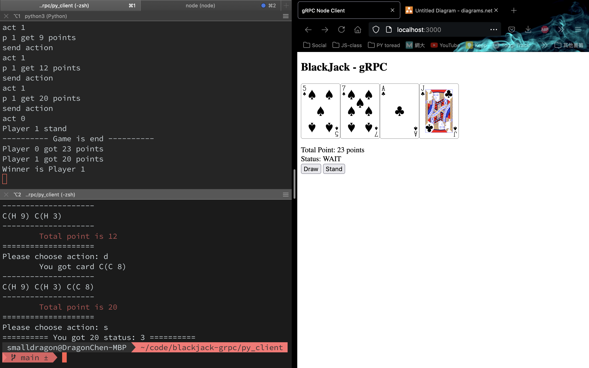

# 計算機網路期末報告 - 補充說明與更多細節

更新進度（4/4）updated: 06/19 06:31

- [X] Node 與 跨語言遊玩
- [X] 系統功能與溝通內容
- [X] Protobuf 自定義通訊內容
- [X] 開發之技術難點

## Node 與 跨語言遊玩

1. 開啟 Server

跟之前的範例一樣，我們共有一台 Server 和兩台 Client

左上角是我們的 Python Server  
左下角是 Python Client  
右邊是 NodeJS Client in browser

啟動遊戲後，右邊 NodeJS 可以點選 Draw 或 Stand 來進行遊戲，點數、狀態和手牌會和左邊的 server 同步顯示

可惜這邊點數爆掉了

接著 Python Client 使用文字輸入，取得二十點後 Stand，Server 顯示最終是贏家為 player 0，完成

使用 gRPC 可以在 Server 邏輯一行都不更改的狀況下，允許你跨越語言的隔閡，使用 protobuf 來進行通訊，十分有趣

## Protobuf 自定義通訊內容

Protobuf 為自定義 binary 資料傳輸的介面

首先可以定義有哪些 rpc 方法，就是 Server 有哪些 Function 可以被呼叫，他的輸入輸出是啥  
在這邊的 Action、Card.....就是輸入出的 message，在下面會進行定義

使用 message 和資料型態來定義一個介面，例如 `int32 p_idx = 2;`  
代表「有一個 int32 欄位叫做 p_idx，位於這個 message 的第二個位置」

ActionNum 則是使用 enum 來 encode 我們會使用到的字串（狀況、不同選項），這個 enum 存為 action_num 名稱，放在 message Action 的第一個位置

深入探索後，可以看到 protobuf 是以 binary 的方式儲存，而且有指名裡面資料欄位的順序，因此不同的資料會出現不同長度的 encode

詳細進去看之後會發現，因為那些為 0 的部分可以直接跳過，相較 RESTful 的冗長 header 和以字串儲存的方法相比，protobuf 能夠有效利用空間、節省不必要的資訊

## 系統功能與溝通內容

功能共分 Server 和 Client 兩大塊，主要說明 RPC 部分傳輸資訊

### Server 端邏輯

1. SendAction

這部分為接收使用者為要牌（DRAW）或不要牌（STAND）的指令，並執行實際抽牌與切換到下個使用者的邏輯

2. CheckStatus

用來讓使用者隨時確認自身遊戲進度和手牌點數，來讓使用者決定是否進行下一個動作

3. GetHistory

讓使用者可獲得手牌資訊，以作為顯示和確認點數用途

### Client 邏輯

Client 端主要分三個遊戲階段，在 Python 和 Node都通用

1. 等待階段

因不確定是否能要牌，需不停向 Server HandShake 來確認自身當前狀態

2. 遊戲階段

由使用者決定是否要牌並輸入，呼叫 Server 進行遊戲  
同時必須不停更新手牌、點數等資訊  

3. 結算等候階段

等待他人完成遊戲  
等待 Server 結算

## 開發之技術難點

開發過程中，gRPC 和 protobuf 的介面為最核心的部分，一開始需要將他設計好，再來是實現 Server 邏輯和撰寫 Client 介面，這部分 Python 的比較好處理，NodeJS 則是多包一層 Express 在瀏覽器顯示。

因此如果一開始設計的邏輯有錯，就必須沿著 gRPC+protobuf、Python Server logic、NodeJS、Express 這三四層來 debug，假如是不熟悉多層架構的開發者或過程中不夠細心，容易導致導致這三四個環節某部分出錯，降低開發速度。

NodeJS 部分我熟悉的 NextJS 和 React 因為 HTTP1.1 和 HTTP2 的不同，必須架設 proxy server 來額外轉換流量（也代表著比較慢）因此我選用比較久沒用的 Express 來開發，過程中也差點以為 Node + gRPC 是不可行的，幸好最後成功完成。